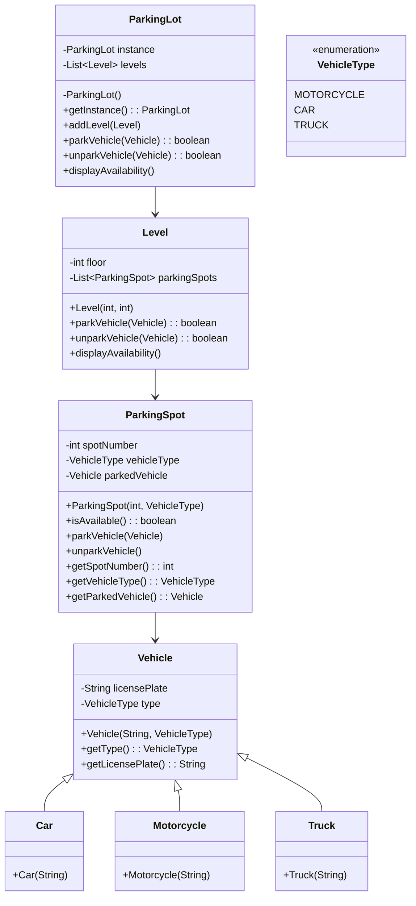

# Parking Lot Design

## Class diagram

## Design Patterns Used
1. **Singleton Pattern**:  
Used in the ParkingLot class to ensure that only one instance of the ParkingLot exists throughout the application.
Implementation: The getInstance() method ensures a single instance is created and shared.
2. **Factory Pattern (implicit)**:  
The Level constructor creates ParkingSpot objects based on the ratio of vehicle types (motorcycles, cars, trucks). This is a simplified form of a factory pattern.
3. **Strategy Pattern (potentially applicable)**:  
The parkVehicle and unparkVehicle methods in Level and ParkingSpot classes encapsulate the behavior of parking and unparking vehicles based on their type. This could be extended to a full strategy pattern if the behavior varies significantly for different vehicle types.
4. **Enumeration Pattern:**  
The VehicleType enum is used to define a fixed set of constants (MOTORCYCLE, CAR, TRUCK) for vehicle types, ensuring type safety and clarity.