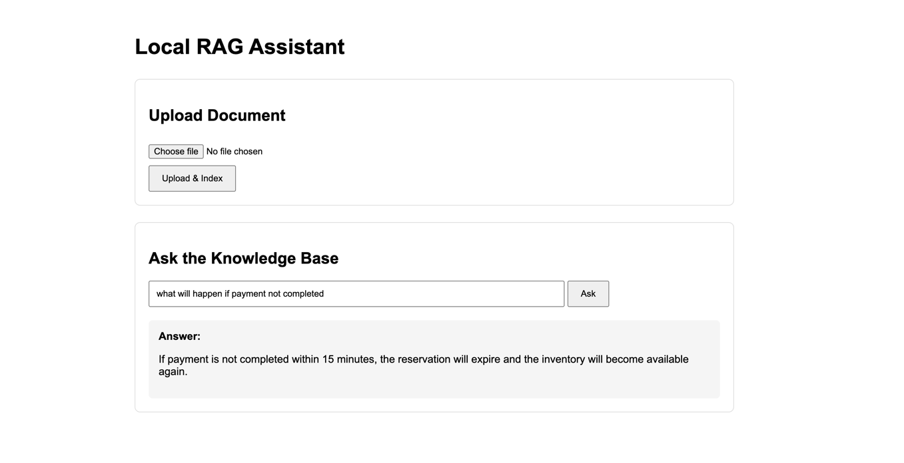

# RAG Application



### Data flow
```
             BROWSER
                │
       Upload product.txt
                │
                ▼
       Spring MVC Controller
                │
                ▼
       DocumentIngestionService
                │
          Chunk document
                │
                ▼
             Ollama
       nomic-embed-text
                │
                ▼
           PostgreSQL
            pgvector
                │
                │
          User asks question
                │
                ▼
             Ollama
       nomic-embed-text
                │
                ▼
          Vector Search
                │
             Top 3
                │
                ▼
       Question + Context
                │
                ▼
             Ollama
             llama3.2
                │
                ▼
             Answer
                │
                ▼
             Browser
```


### Connect to vector db
```bash
docker exec -it rag-postgres psql -U postgres -d ragdb
```
