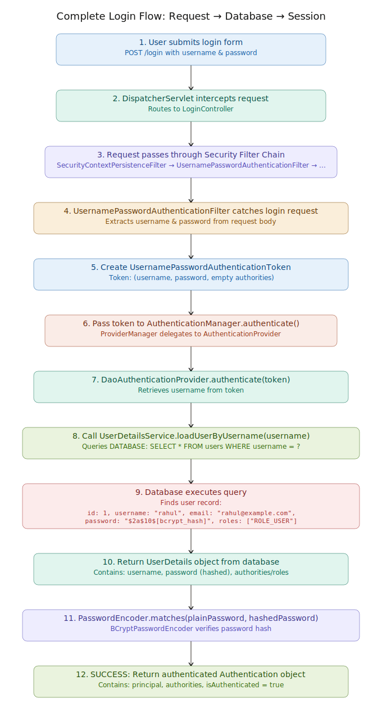

# Complete Spring Security Login Flow: From API Call to Database


---
## Overview
1. User submits login credentials via HTTP POST
2. Request flows through servlet filters
3. Credentials extracted and validated against database
4. Session created and user authenticated
5. Authenticated user can access secured resources

## 1. User Submits Login Form

**Frontend (HTML Form)**
```html
<form action="/login" method="POST">
    <input type="text" name="username" placeholder="Username">
    <input type="password" name="password" placeholder="Password">
    <button type="submit">Login</button>
</form>
```

**OR REST API Call**
```bash
curl -X POST http://localhost:8080/login \
  -H "Content-Type: application/x-www-form-urlencoded" \
  -d "username=rahul&password=myPassword123"
```

HTTP Request:
```
POST /login HTTP/1.1
Host: localhost:8080
Content-Type: application/x-www-form-urlencoded
Content-Length: 38

username=rahul&password=myPassword123
```

---

## 2. Security Configuration (Backend Setup)

**SecurityConfig.java** - Defines how Spring Security should handle login
```java
@Configuration
@EnableWebSecurity
public class SecurityConfig extends WebSecurityConfigurerAdapter {

    @Autowired
    private UserDetailsService userDetailsService;

    @Override
    protected void configure(HttpSecurity http) throws Exception {
        http
            .authorizeRequests()
                .antMatchers("/login").permitAll()        // Public endpoint
                .antMatchers("/admin/**").hasRole("ADMIN") // Admin only
                .anyRequest().authenticated()              // Everything else requires auth
            .and()
            .formLogin()
                .loginPage("/login")                       // Custom login page
                .loginProcessingUrl("/login")              // Form submits here
                .usernameParameter("username")             // Form field names
                .passwordParameter("password")
                .defaultSuccessUrl("/dashboard")           // Redirect after success
                .failureUrl("/login?error=true")           // Redirect on failure
            .and()
            .logout()
                .logoutUrl("/logout")
                .deleteCookies("JSESSIONID");
    }

    @Bean
    public PasswordEncoder passwordEncoder() {
        return new BCryptPasswordEncoder(); // Hashes passwords with BCrypt
    }

    @Bean
    public AuthenticationManager authenticationManager() throws Exception {
        return super.authenticationManager();
    }
}
```

---

## 3. Database Schema

**User Entity (Database Table)**
```sql
CREATE TABLE users (
    id BIGINT PRIMARY KEY AUTO_INCREMENT,
    username VARCHAR(255) NOT NULL UNIQUE,
    email VARCHAR(255),
    password VARCHAR(255) NOT NULL,  -- Stores BCrypt hash, NOT plaintext
    enabled BOOLEAN DEFAULT TRUE,
    created_at TIMESTAMP DEFAULT CURRENT_TIMESTAMP
);

CREATE TABLE roles (
    id BIGINT PRIMARY KEY AUTO_INCREMENT,
    role_name VARCHAR(50) NOT NULL UNIQUE
);

CREATE TABLE user_roles (
    user_id BIGINT NOT NULL,
    role_id BIGINT NOT NULL,
    PRIMARY KEY (user_id, role_id),
    FOREIGN KEY (user_id) REFERENCES users(id),
    FOREIGN KEY (role_id) REFERENCES roles(id)
);

-- Sample data
INSERT INTO users (username, email, password, enabled) VALUES
('rahul', 'rahul@example.com', '$2a$10$N9qo8uLOickgx2ZMRZoMyeIjZAgcg7b3XeKeUxWdeS86.CHyVfAzO', true);

INSERT INTO roles (role_name) VALUES ('ROLE_USER'), ('ROLE_ADMIN');

INSERT INTO user_roles (user_id, role_id) VALUES (1, 1);
```

The password field stores a **BCrypt hash**, NOT the plaintext password:
- Original: `myPassword123`
- BCrypt Hash: `$2a$10$N9qo8uLOickgx2ZMRZoMyeIjZAgcg7b3XeKeUxWdeS86.CHyVfAzO`

---

## 4. UserDetailsService Implementation

**Custom UserDetailsService** - Loads user from database
```java
@Service
public class CustomUserDetailsService implements UserDetailsService {

    @Autowired
    private UserRepository userRepository;

    @Autowired
    private RoleRepository roleRepository;

    /**
     * Called by Spring Security during authentication
     * to load user by username from the database
     */
    @Override
    public UserDetails loadUserByUsername(String username) 
            throws UsernameNotFoundException {
        
        // Query database for user
        User user = userRepository.findByUsername(username)
            .orElseThrow(() -> new UsernameNotFoundException(
                "User not found: " + username
            ));

        // Fetch user's roles from database
        Set<GrantedAuthority> authorities = user.getRoles().stream()
            .map(role -> new SimpleGrantedAuthority(role.getRoleName()))
            .collect(Collectors.toSet());

        // Return UserDetails object (Spring's user representation)
        return new org.springframework.security.core.userdetails.User(
            user.getUsername(),           // username
            user.getPassword(),           // hashed password from DB
            user.isEnabled(),             // is account enabled
            true,                         // is account non-expired
            true,                         // is credentials non-expired
            true,                         // is account non-locked
            authorities                   // authorities/roles
        );
    }
}
```

**User Entity (JPA Model)**
```java
@Entity
@Table(name = "users")
public class User {
    @Id
    @GeneratedValue(strategy = GenerationType.IDENTITY)
    private Long id;

    @Column(nullable = false, unique = true)
    private String username;

    @Column(nullable = false)
    private String email;

    @Column(nullable = false)
    private String password;  // Stores BCrypt hash

    private boolean enabled = true;

    @ManyToMany(fetch = FetchType.EAGER)
    @JoinTable(
        name = "user_roles",
        joinColumns = @JoinColumn(name = "user_id"),
        inverseJoinColumns = @JoinColumn(name = "role_id")
    )
    private Set<Role> roles = new HashSet<>();

    @CreationTimestamp
    private LocalDateTime createdAt;

    // Getters and setters...
}

@Entity
@Table(name = "roles")
public class Role {
    @Id
    @GeneratedValue(strategy = GenerationType.IDENTITY)
    private Long id;

    @Column(nullable = false, unique = true)
    private String roleName;  // e.g., "ROLE_USER", "ROLE_ADMIN"

    // Getters and setters...
}
```

**UserRepository (Database Access)**
```java
@Repository
public interface UserRepository extends JpaRepository<User, Long> {
    Optional<User> findByUsername(String username);
    Optional<User> findByEmail(String email);
}
```

---

## 5. Authentication Filter Flow

**UsernamePasswordAuthenticationFilter** (Spring Security's built-in)
```
This filter automatically:
1. Intercepts POST /login requests
2. Extracts username & password from request
3. Creates UsernamePasswordAuthenticationToken
4. Passes to AuthenticationManager
```

Equivalent custom filter (for understanding):
```java
@Component
public class CustomAuthenticationFilter extends OncePerRequestFilter {

    @Autowired
    private AuthenticationManager authenticationManager;

    @Override
    protected void doFilterInternal(HttpServletRequest request, 
                                   HttpServletResponse response, 
                                   FilterChain filterChain) 
            throws ServletException, IOException {
        
        // Step 1: Check if this is a login request
        if (request.getRequestURI().equals("/login") && 
            request.getMethod().equals("POST")) {
            
            // Step 2: Extract credentials from request
            String username = request.getParameter("username");
            String password = request.getParameter("password");
            
            // Step 3: Create authentication token (NOT yet authenticated)
            UsernamePasswordAuthenticationToken token = 
                new UsernamePasswordAuthenticationToken(
                    username,      // principal (username)
                    password,      // credentials (plaintext password)
                    new ArrayList<>() // authorities (empty - not yet authenticated)
                );
            
            // Step 4: Pass to AuthenticationManager
            Authentication authentication = authenticationManager.authenticate(token);
            
            // Step 5: If successful, set in SecurityContext
            if (authentication.isAuthenticated()) {
                SecurityContextHolder.getContext().setAuthentication(authentication);
                request.getSession().setAttribute("SPRING_SECURITY_CONTEXT", 
                    SecurityContextHolder.getContext());
                response.sendRedirect("/dashboard");
            } else {
                response.sendRedirect("/login?error=true");
            }
            return;
        }
        
        filterChain.doFilter(request, response);
    }
}
```

---

## 6. AuthenticationManager Flow

**Step-by-step authentication process:**

```java
// 1. AuthenticationManager receives token
AuthenticationManager authenticationManager = // obtained from config

// 2. Create token with credentials
UsernamePasswordAuthenticationToken token = 
    new UsernamePasswordAuthenticationToken("rahul", "myPassword123");

// 3. AuthenticationManager delegates to ProviderManager
// which iterates through registered AuthenticationProviders
ProviderManager providerManager = (ProviderManager) authenticationManager;

// 4. DaoAuthenticationProvider is called
for (AuthenticationProvider provider : providerManager.getProviders()) {
    if (provider.supports(UsernamePasswordAuthenticationToken.class)) {
        // DaoAuthenticationProvider.authenticate(token)
        Authentication result = provider.authenticate(token);
    }
}
```

**DaoAuthenticationProvider** (Spring's built-in)
```java
public class DaoAuthenticationProvider extends AbstractUserDetailsAuthenticationProvider {

    @Autowired
    private UserDetailsService userDetailsService;

    @Autowired
    private PasswordEncoder passwordEncoder;

    /**
     * Main authentication logic
     */
    @Override
    protected void additionalAuthenticationChecks(
            UserDetails userDetails,
            UsernamePasswordAuthenticationToken authentication) 
            throws AuthenticationException {
        
        // Get plaintext password from incoming token
        String presentedPassword = authentication.getCredentials().toString();
        
        // Get hashed password from database (stored in UserDetails)
        String storedPassword = userDetails.getPassword();
        
        // Use PasswordEncoder to verify
        if (!passwordEncoder.matches(presentedPassword, storedPassword)) {
            throw new BadCredentialsException("Invalid password");
        }
    }

    /**
     * Load user from database
     */
    @Override
    protected UserDetails retrieveUser(String username, 
                                      UsernamePasswordAuthenticationToken authentication) 
            throws AuthenticationException {
        
        // DATABASE QUERY HAPPENS HERE
        UserDetails user = userDetailsService.loadUserByUsername(username);
        
        if (user == null) {
            throw new UsernameNotFoundException("User not found");
        }
        
        return user;
    }
}
```

---

## 7. Authentication Sequence Diagram

```
Client                Filter Chain              AuthManager           Database
  |                        |                         |                    |
  |--- POST /login ------->|                         |                    |
  |   (username, password) |                         |                    |
  |                        |                         |                    |
  |                   Create Token                   |                    |
  |                        |--- authenticate() ---->|                    |
  |                        |                         |                    |
  |                        |        loadUserByUsername()                  |
  |                        |                         |--- SELECT * ----->|
  |                        |                         |<--- UserRecord ----|
  |                        |                         |                    |
  |                        |    verify password hash                      |
  |                        |    BCrypt.matches(input, stored)            |
  |                        |                         |                    |
  |                        |<--- Authentication ---|                    |
  |                   (authenticated=true, authorities)                  |
  |                        |                         |                    |
  |<--- 302 Redirect ------|                         |                    |
  |    to /dashboard       |                         |                    |
  |                        |                         |                    |
  | (Session created with authenticated user)      |                    |
```

---

## 8. Session Management After Login

**SecurityContextPersistenceFilter** (Session handling)

After successful authentication:
```java
// Spring stores authentication in SecurityContext
SecurityContext context = SecurityContextHolder.createEmptyContext();
context.setAuthentication(authentication);  // authenticated=true
SecurityContextHolder.setContext(context);

// Then persists to HTTP Session
HttpSession session = request.getSession(true);
session.setAttribute("SPRING_SECURITY_CONTEXT", context);

// Browser receives Set-Cookie header
// Response: Set-Cookie: JSESSIONID=ABC123DEF456; Path=/; HttpOnly
```

**On subsequent requests:**
```
1. Client sends: Cookie: JSESSIONID=ABC123DEF456
2. SecurityContextPersistenceFilter loads from session
3. Sets SecurityContext in ThreadLocal
4. User is automatically authenticated for that request
5. No need to re-enter password
```

---

## 9. Complete Database Query Example

**Actual SQL executed:**

```sql
-- Query 1: Find user by username
SELECT 
    u.id, u.username, u.email, u.password, u.enabled, u.created_at
FROM users u
WHERE u.username = 'rahul'
LIMIT 1;

-- Result:
-- id=1, username=rahul, email=rahul@example.com, 
-- password=$2a$10$N9qo8uLOickgx2ZMRZoMyeIjZAgcg7b3XeKeUxWdeS86.CHyVfAzO, 
-- enabled=true, created_at=2024-05-20

-- Query 2: Fetch user's roles (via JPA relationship loading)
SELECT r.id, r.role_name
FROM roles r
INNER JOIN user_roles ur ON r.id = ur.role_id
WHERE ur.user_id = 1;

-- Result:
-- id=1, role_name=ROLE_USER
```

---

## 10. Login Controller (Optional Custom Endpoint)

```java
@Controller
public class LoginController {

    @GetMapping("/login")
    public String loginPage() {
        return "login";  // Returns login.html template
    }

    @PostMapping("/login")
    public String handleLogin(
            @RequestParam String username,
            @RequestParam String password,
            HttpServletRequest request,
            Model model) {
        
        // In Spring Security form-based auth, this is usually NOT called
        // The UsernamePasswordAuthenticationFilter handles it automatically
        
        // But if you need custom logic:
        try {
            Authentication auth = new UsernamePasswordAuthenticationToken(
                username, password
            );
            Authentication authenticated = 
                authenticationManager.authenticate(auth);
            
            SecurityContextHolder.getContext().setAuthentication(authenticated);
            
            return "redirect:/dashboard";
        } catch (AuthenticationException e) {
            model.addAttribute("error", "Invalid username or password");
            return "login";
        }
    }

    @GetMapping("/dashboard")
    @PreAuthorize("isAuthenticated()")  // Require login
    public String dashboard(Authentication auth, Model model) {
        // Get current authenticated user
        String username = auth.getName();
        model.addAttribute("username", username);
        
        // Get user's authorities/roles
        Set<String> roles = auth.getAuthorities().stream()
            .map(GrantedAuthority::getAuthority)
            .collect(Collectors.toSet());
        model.addAttribute("roles", roles);
        
        return "dashboard";
    }
}
```

---

## 11. Password Hashing (BCrypt Example)

**During User Registration:**
```java
@PostMapping("/register")
public String register(@RequestParam String username,
                      @RequestParam String password) {
    // Hash password before storing in DB
    String hashedPassword = passwordEncoder.encode(password);
    
    User user = new User();
    user.setUsername(username);
    user.setPassword(hashedPassword);  // Store HASH, not plaintext
    
    userRepository.save(user);
    return "redirect:/login";
}

// Plaintext: "myPassword123"
// BCrypt Hash: "$2a$10$N9qo8uLOickgx2ZMRZoMyeIjZAgcg7b3XeKeUxWdeS86.CHyVfAzO"
```

**During Login (Authentication):**
```java
// PasswordEncoder.matches() does NOT decrypt the hash
// Instead, it hashes the incoming password and compares hashes

String incomingPassword = "myPassword123";  // Plaintext from form
String storedHash = "$2a$10$N9qo8uLOickgx2ZMRZoMyeIjZAgcg7b3XeKeUxWdeS86.CHyVfAzO";

boolean passwordValid = passwordEncoder.matches(incomingPassword, storedHash);
// Returns: true

// How it works:
// 1. Hash the incoming password with the same salt from the stored hash
// 2. Compare hashes (not the plaintext)
// 3. If hashes match, password is correct
```

---

## 12. Error Handling

```java
@ControllerAdvice
public class AuthenticationExceptionHandler {

    @ExceptionHandler(UsernameNotFoundException.class)
    public String handleUsernameNotFound(UsernameNotFoundException e, 
                                        Model model) {
        model.addAttribute("error", "Username does not exist");
        return "login";
    }

    @ExceptionHandler(BadCredentialsException.class)
    public String handleBadCredentials(BadCredentialsException e,
                                      Model model) {
        model.addAttribute("error", "Invalid password");
        return "login";
    }

    @ExceptionHandler(LockedException.class)
    public String handleLockedAccount(LockedException e,
                                     Model model) {
        model.addAttribute("error", "Account is locked");
        return "login";
    }

    @ExceptionHandler(DisabledException.class)
    public String handleDisabledAccount(DisabledException e,
                                       Model model) {
        model.addAttribute("error", "Account is disabled");
        return "login";
    }
}
```

---

## 13. Summary: What Happens at Each Layer

| Layer | What Happens | Code |
|-------|--------------|------|
| **Browser** | User enters username & password | HTML form or REST request |
| **HTTP** | POST /login with credentials | POST body: `username=rahul&password=...` |
| **Servlet** | DispatcherServlet routes request | Dispatches to LoginController or filter |
| **Filter Chain** | UsernamePasswordAuthenticationFilter intercepts | Creates authentication token |
| **Authentication Manager** | Delegates to DaoAuthenticationProvider | authenticate(token) |
| **UserDetailsService** | Queries database for user | SELECT * FROM users WHERE username = ? |
| **Database** | Returns user record with hashed password | Sends UserDetails object |
| **Password Verification** | BCryptPasswordEncoder.matches() | Compares hashes |
| **Session** | Creates HTTP session and stores authentication | Sets JSESSIONID cookie |
| **Response** | Redirects to dashboard | HTTP 302 with JSESSIONID cookie |

---

## 14. Key Security Principles

✅ **Never store plaintext passwords** — Always hash with BCrypt, PBKDF2, or Argon2

✅ **Use HTTPS** — Passwords transmitted over encrypted connection

✅ **HttpOnly cookies** — JavaScript can't access session cookies

✅ **CSRF protection** — Spring adds CSRF tokens to forms by default

✅ **Validate input** — Prevent SQL injection (use parameterized queries/JPA)

✅ **Log security events** — Track login attempts for auditing

❌ **Don't use MD5/SHA1** — These are cryptographically broken

❌ **Don't log passwords** — Even during authentication

❌ **Don't send passwords in URLs** — Use POST body only
